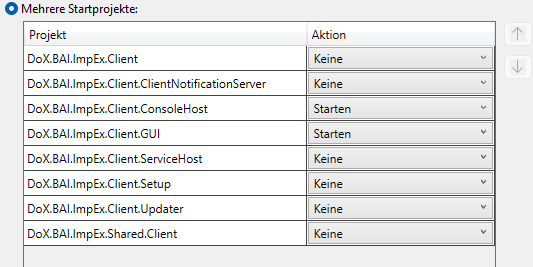

# DornerLink_Client

## Startup

Projektmappe -> Mehere Startprojekte

- DoX.BAI.ImpEx.Client.ConsoleHost
- DoX.BAI.ImpEx.Client.GUI
  

Sollte ein Fehler beim Starten der Projekte auftreten welcher sich auf `MainForm.resx` bezieht:

```
Unblock-File -Path .\MainForm.resx
```

in Power-Shell als Administrator ausführen

## Testdatenbank

```
Host: plesk.powered.ws
```

```
Datenbank: bai_test_db
```

```
User: PPMC_TEST
```

```
Passwort: sc1zB070?
```

Link MySQL:
https://plesk.powered.ws/phpMyAdmin/

## Directus Data Integration

### Dokumentation für Directus mit Docker Compose

### Einführung

Directus ist eine Open-Source-Software, die jede SQL-Datenbank mit einer Echtzeit-GraphQL+REST-API und einer intuitiven App für nicht-technische Benutzer umschließt. Es ist ein leistungsstarkes Werkzeug für Entwickler, während es für weniger technische Benutzer zugänglich ist, um Inhalte zu verwalten.

## Verwendung dieser `docker-compose.yml`-Datei

Diese `docker-compose.yml`-Datei ist konfiguriert, um Directus mit einer MySQL-Datenbank auszuführen. Im Folgenden finden Sie eine schrittweise Anleitung zur Verwendung:

### Voraussetzungen

- Docker und Docker Compose sind auf Ihrem System installiert.
- Stellen Sie sicher, dass die angegebenen Ports und Volumes nicht mit anderen Diensten in Konflikt stehen.

### `docker-compose.yml`-Datei

```yaml
version: "3.9"

services:
  directus:
    container_name: directus1
    image: directus/directus:latest
    ports:
      - 8056:8055
    volumes:
      - ./uploads:/directus/uploads
    environment:
      KEY: "255d861b-5ea1-5996-9aa3-922530ec40b2"
      SECRET: "6116487b-cda1-52c2-b5b5-c8022c45e264"
      DB_CLIENT: "mysql"
      DB_HOST: "plesk.powered.ws"
      DB_PORT: "3306"
      DB_DATABASE: "bai_test_db"
      DB_USER: "PPMC_TEST"
      DB_PASSWORD: "sc1zB070?"
      ADMIN_EMAIL: "admin@example.com"
      ADMIN_PASSWORD: "d1r3ctu5"
      DB_POOL__MIN: 0
```

### Anleitung

1. **Projekt klonen**: Erstellen Sie ein neues Verzeichnis für Ihr Projekt und klonen Sie dieses Repository hinein.
2. **Umgebungsvariablen**: Passen Sie die Umgebungsvariablen nach Bedarf an. Stellen Sie sicher, dass Sie sichere Passwörter und Konfigurationen verwenden.
   - `KEY` und `SECRET`: Werden verwendet, um Tokens zu sichern. Ändern Sie sie in sichere zufällige Zeichenketten.
   - `DB_CLIENT`, `DB_HOST`, `DB_PORT`, `DB_DATABASE`, `DB_USER` und `DB_PASSWORD`: Konfigurieren Sie diese, um Ihren MySQL-Datenbankanmeldeinformationen zu entsprechen.
   - `ADMIN_EMAIL` und `ADMIN_PASSWORD`: Legen Sie diese auf Ihre bevorzugten Admin-Anmeldeinformationen fest.
3. **Volumes**: Stellen Sie sicher, dass die Volumes für Uploads (und Datenbank, wenn SQLite verwendet wird) korrekt auf Ihr Hostsystem für persistenten Speicher abgebildet sind.
4. **Ports**: Directus ist so konfiguriert, dass es auf Port 8056 auf dem Hostsystem läuft und auf 8055 im Container abgebildet wird. Stellen Sie sicher, dass dieser Port verfügbar ist.
5. **Docker Compose ausführen**: Verwenden Sie den folgenden Befehl, um die Dienste zu starten:
   ```sh
   docker-compose up -d
   ```
