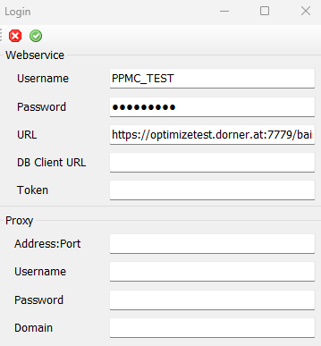

# DornerLink_Client

## Startup

Projektmappe -> Mehere Startprojekte

- DoX.BAI.ImpEx.Client.ConsoleHost
- DoX.BAI.ImpEx.Client.GUI
  

Sollte ein Fehler beim Starten der Projekte auftreten welcher sich auf `MainForm.resx` bezieht:

```
Unblock-File -Path .\MainForm.resx
```

in Power-Shell als Administrator ausführen

## Testdatenbank

```
Host: plesk.powered.ws
```

```
Datenbank: bai_test_db
```

```
User: PPMC_TEST
```

```
Passwort: sc1zB070?
```

Link MySQL:
https://plesk.powered.ws/phpMyAdmin/

## Directus Data Integration (Integration Client)

### Dokumentation für Directus mit Docker Compose

### Einführung

Directus ist eine Open-Source-Software, die jede SQL-Datenbank mit einer Echtzeit-GraphQL+REST-API und einer intuitiven App für nicht-technische Benutzer umschließt. Es ist ein leistungsstarkes Werkzeug für Entwickler, während es für weniger technische Benutzer zugänglich ist, um Inhalte zu verwalten.

## Verwendung dieser `docker-compose.yml`-Datei

Diese `docker-compose.yml`-Datei ist konfiguriert, um Directus mit einer MySQL-Datenbank auszuführen. Im Folgenden finden Sie eine schrittweise Anleitung zur Verwendung:

### Voraussetzungen

- Docker und Docker Compose sind auf Ihrem System installiert.
- Stellen Sie sicher, dass die angegebenen Ports und Volumes nicht mit anderen Diensten in Konflikt stehen.

### `docker-compose.yml`-Datei

```yaml
version: "3.9"

services:
  directus:
    container_name: directus1
    image: directus/directus:latest
    ports:
      - 8056:8055
    volumes:
      - ./uploads:/directus/uploads
    environment:
      KEY: "255d861b-5ea1-5996-9aa3-922530ec40b2"
      SECRET: "6116487b-cda1-52c2-b5b5-c8022c45e264"
      DB_CLIENT: "mysql"
      DB_HOST: "plesk.powered.ws"
      DB_PORT: "3306"
      DB_DATABASE: "bai_test_db"
      DB_USER: "PPMC_TEST"
      DB_PASSWORD: "sc1zB070?"
      ADMIN_EMAIL: "admin@example.com"
      ADMIN_PASSWORD: "d1r3ctu5"
      DB_POOL__MIN: 0
```

### Anleitung

1. **Projekt klonen**: Erstellen Sie ein neues Verzeichnis für Ihr Projekt und klonen Sie dieses Repository hinein.
2. **Umgebungsvariablen**: Passen Sie die Umgebungsvariablen nach Bedarf an. Stellen Sie sicher, dass Sie sichere Passwörter und Konfigurationen verwenden.
   - `KEY` und `SECRET`: Werden verwendet, um Tokens zu sichern. Ändern Sie sie in sichere zufällige Zeichenketten.
   - `DB_CLIENT`, `DB_HOST`, `DB_PORT`, `DB_DATABASE`, `DB_USER` und `DB_PASSWORD`: Konfigurieren Sie diese, um Ihren MySQL-Datenbankanmeldeinformationen zu entsprechen.
   - `ADMIN_EMAIL` und `ADMIN_PASSWORD`: Legen Sie diese auf Ihre bevorzugten Admin-Anmeldeinformationen fest.
3. **Volumes**: Stellen Sie sicher, dass die Volumes für Uploads (und Datenbank, wenn SQLite verwendet wird) korrekt auf Ihr Hostsystem für persistenten Speicher abgebildet sind.
4. **Ports**: Directus ist so konfiguriert, dass es auf Port 8056 auf dem Hostsystem läuft und auf 8055 im Container abgebildet wird. Stellen Sie sicher, dass dieser Port verfügbar ist.
5. **Docker Compose ausführen**: Verwenden Sie den folgenden Befehl, um die Dienste zu starten:
   ```sh
   docker-compose up -d
   ```

## DornerLink_Client Konfiguration

(+) IntegrationClientUrl\
(+) IntegrationClientToken

### IntegrationClientUrl

Die Serveradresse des Integration Clients z.B: `http://localhost:8056/`

### IntegrationClientToken

Token des Service Users z.B: `E1aHku9hSXy1e7_Zi6F2QzweRVe1CgzR`



## Erstellen einer neuen Tabelle und Hinzufügen von Feldern in Directus

Directus ist ein Headless CMS, das eine intuitive Weboberfläche für die Verwaltung von Datenbankinhalten bietet. In dieser kurzen Anleitung zeigen wir Ihnen, wie Sie eine neue Tabelle erstellen und Felder zu dieser Tabelle hinzufügen können.

### Voraussetzungen

- Eine laufende Instanz von Directus.
- Zugriff auf das Directus Admin-Panel.
- Administratorrechte oder ausreichende Berechtigungen zum Erstellen von Tabellen und Feldern.

### Schritt 1: Anmelden im Directus Admin-Panel

1. Öffnen Sie Ihren Webbrowser und navigieren Sie zur URL Ihrer Directus-Instanz.
2. Melden Sie sich mit Ihrem Benutzernamen und Passwort an.

### Schritt 2: Navigieren zum Datenmodell-Bereich

1. Klicken Sie im linken Seitenmenü auf das Symbol für "Datenmodell".
2. Sie gelangen nun in den Bereich, in dem Sie die Datenstrukturen Ihrer Datenbank verwalten können.

### Schritt 3: Erstellen einer neuen Tabelle

1. Klicken Sie auf den Button „+ Tabelle erstellen“.
2. Geben Sie den Namen Ihrer neuen Tabelle ein.
3. Optional können Sie auch eine Beschreibung für die Tabelle hinzufügen.
4. Klicken Sie auf „Erstellen“, um die Tabelle zu erstellen.

### Schritt 4: Hinzufügen von Feldern zur Tabelle

1. Nachdem die Tabelle erstellt wurde, werden Sie zur Strukturansicht dieser Tabelle weitergeleitet.
2. Klicken Sie hier auf „+ Feld hinzufügen“, um ein neues Feld zu erstellen.
3. Wählen Sie den Feldtyp aus, den Sie hinzufügen möchten (z.B. Text, Zahl, Datum usw.).
4. Geben Sie einen Namen für das Feld ein.
5. Konfigurieren Sie die weiteren Einstellungen des Feldes nach Ihren Bedürfnissen.
6. Klicken Sie auf „Hinzufügen“, um das Feld zur Tabelle hinzuzufügen.

### Schritt 5: Überprüfen und Speichern

1. Überprüfen Sie, ob alle Felder korrekt hinzugefügt wurden und ob die Einstellungen korrekt sind.
2. Klicken Sie auf „Speichern“, um die Änderungen zu übernehmen.

### Fazit

Nachdem Sie diese Schritte durchgeführt haben, sollten Sie nun eine neue Tabelle mit den gewünschten Feldern in Ihrem Directus CMS haben. Sie können nun Inhalte zu dieser Tabelle hinzufügen und sie in Ihren Projekten verwenden. Directus bietet eine Vielzahl von Feldtypen und Konfigurationsoptionen, sodass Sie Ihre Datenmodelle genau nach Ihren Bedürfnissen anpassen können.

### Hinweis

```
Achten Sie darauf das die Tabelle den selben Namen trägt wie die Kategorie welche vom BAI Service bereitgestellt wird.
```

### Install service on host

1. Execute PowerShell command as Admin
```
sc.exe create "BAI_Host" binPath="C:\source\DoX.BAI.ImpEx.Client\DoX.BAI.ImpEx.Client.Setup\bin\Debug\DoX.BAI.ImpEx.Client.ServiceHost.exe" start= auto
```

2. Start the service
3. Open GUI
4. Set server credential
5. Set middleware endpoint e.g: /api/ingest